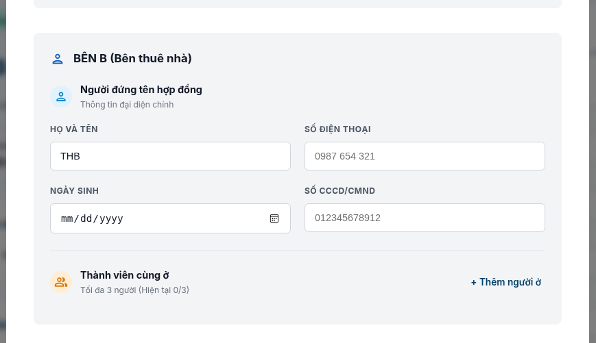
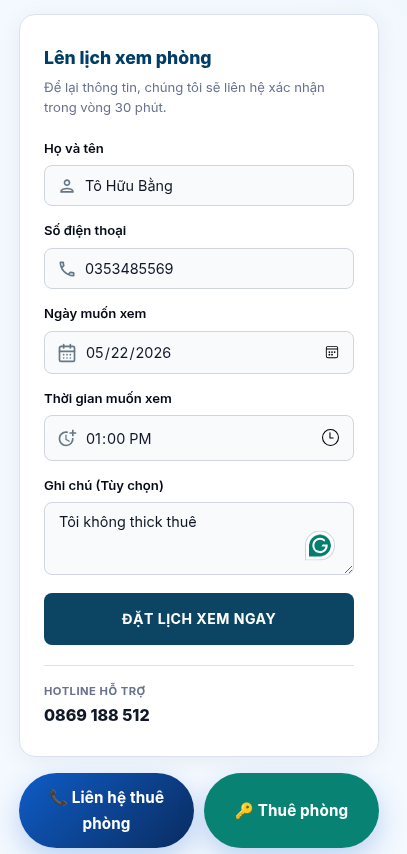

# Những thứ cần bổ sung cho dự án

**Tác giả:** thb
**Ngày:** 2026-05-18
**Status:** Đang tổng hợp — bổ sung dần

> Note này tổng hợp các hạng mục còn thiếu / cần xem xét lại so với đề xuất ban đầu (`DE_XUAT_DO_AN.md`). Mỗi mục ghi: vấn đề, đề xuất, lý do, mức ưu tiên.

---

## 1. Email service — đổi Gmail SMTP sang Resend

**Trạng thái đề xuất hiện tại:** `DE_XUAT_QUEN_MAT_KHAU.md` mục 4 đang chọn **Nodemailer + Gmail SMTP**.

**Vấn đề với Gmail SMTP:**

| Vấn đề                                      | Mô tả                                                                                                                          |
| ------------------------------------------- | ------------------------------------------------------------------------------------------------------------------------------ |
| Rate limit                                  | 500 emails/day (free Gmail), 2000/day (Workspace) → dễ chạm trần khi hệ thống gửi reminder + hóa đơn + notification hàng tháng |
| Deliverability kém                          | Gmail không phải transactional email service → tỷ lệ vào spam folder cao, đặc biệt khi gửi cùng nội dung cho nhiều người       |
| Sender address xấu                          | `yourapp@gmail.com` nhìn nghiệp dư, khách thuê dễ nghi ngờ là lừa đảo                                                          |
| Không debug được                            | Không biết email có bounce không, có vào inbox không, user có mở không                                                         |
| Không setup được DKIM/SPF cho custom domain | Càng làm deliverability tệ hơn                                                                                                 |

**Đề xuất:** Dùng **Resend** ngay từ đầu.

**So sánh Resend vs SendGrid:**

| Tiêu chí               | Resend                               | SendGrid         |
| ---------------------- | ------------------------------------ | ---------------- |
| Free tier              | 3000/month, 100/day                  | 100/day forever  |
| Developer Experience   | Modern, API gọn                      | Cũ, nhiều config |
| Setup time             | ~15 phút                             | ~1 tiếng         |
| Template               | React Email (hợp với stack hiện tại) | Handlebars riêng |
| Có Dashboard analytics | ✅                                   | ✅               |

**Lý do chọn Resend:**

- Stack đang là React → React Email tích hợp tự nhiên
- 3000 emails/month free dư cho scale của app quản lý phòng (~50-200 phòng)
- DX tốt → setup nhanh, ít rủi ro lỗi config

**Mức ưu tiên:** 🔴 Cao — nên đổi trước khi implement feature forgot-password, không nên defer.

**Ảnh hưởng:**

- `DE_XUAT_QUEN_MAT_KHAU.md` mục 4: đổi "Nodemailer + Gmail SMTP" → "Resend"
- Backend dependency: `npm install resend` thay vì `nodemailer`
- Env vars: `RESEND_API_KEY` thay vì `EMAIL_USER`, `EMAIL_PASS`
- Cần verify 1 domain hoặc dùng `onboarding@resend.dev` cho dev/test

---

## 2. [Thông báo cho nhân viên biết là có ai đặt phòng]

## 3. [Thu hồi quyền của nhân viên thì nên xoá tài khoản luôn]

## 4. [Báo cáo cho admin]

## 5. [Khách thuể phòng cần có khảo sát]

## 6. [Chức năng phòng yêu thích]

## 7. [Random lượt xem đang bị nhảy liên tục khi điền thông tin]

## 8.[Nên đền thông tin của user vào đơn luôn khi bấm thuê phòng]

**Vấn đề:** Khi user đã đăng nhập và bấm "Thuê phòng" hoặc "Đặt lịch xem", form vẫn để trống → user phải gõ lại tên, SĐT, ngày sinh, CCCD. Trùng dữ liệu đã có trong account.

**Đề xuất:** Lấy thông tin có sẵn từ user đang đăng nhập, prefill vào form. User chỉ cần sửa nếu khác.

### Ảnh minh họa

**Form hợp đồng — phần BÊN B (Bên thuê nhà):**

→ HỌ VÀ TÊN, SỐ ĐIỆN THOẠI, NGÀY SINH, SỐ CCCD/CMND đều nên auto-fill từ user profile.

**Form đặt lịch xem phòng:**

→ Họ và tên, Số điện thoại cũng nên auto-fill. Ngày + thời gian thì user tự chọn.

###

Thanh toán VNPay:
Ngân hàng: NCB
Số thẻ: 9704198526191432198
Tên chủ thẻ:NGUYEN VAN A
Ngày phát hành:07/15
Mật khẩu OTP:123456

ádasdasdq1weq