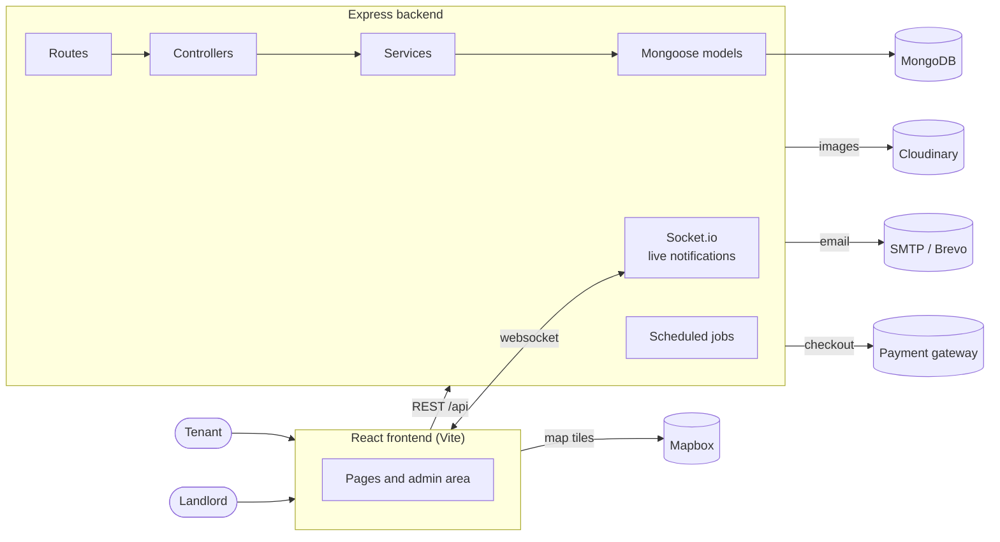

# Room Management

A rental and booking platform for a room letting business: tenants browse and book rooms, sign
contracts, pay online and raise incidents; the landlord manages rooms, contracts, invoices,
services and expenses from an admin area.

**Live demo:** https://room-management-pearl.vercel.app

---

## Features

**For tenants**
- 🔎 **Search and browse** rooms, with a map view and a favourites list
- 📅 **Appointments** — book a viewing before committing
- 🛏️ **Bookings** — reserve a room within its booking window
- 📝 **Contracts** — sign electronically and download the signed contract as a PDF
- 💳 **Online payment** — pay invoices through a payment gateway
- 🧰 **Service bookings** — order extra services (cleaning, repairs) and track them
- 🛠️ **Incidents** — report a problem and follow its progress on a timeline
- 💬 **Chat and notifications** — in-app messaging and live notifications
- ⭐ **Feedback** — review a room after staying

**For the landlord**
- 🏠 **Rooms and room map** — manage rooms and arrange them on a drag-and-drop floor map
- 📄 **Contracts and invoices** — issue, track and settle
- 💰 **Expenses and promotions** — record costs, run discount campaigns
- 📊 **Dashboard** — charts over bookings, revenue and occupancy

---

## Architecture



---

## Notable pieces

**Live notifications.** The backend runs Socket.io alongside the REST API, so a booking, an
incident update or a new message reaches the other party without the page polling for it.

**A contract lifecycle that moves on its own.** A tenancy changes state whether or not anyone opens
the app, so a daily job walks the whole set and applies the transitions: renewal contracts become
active on their start date, contracts approaching their end date raise a warning, contracts past
their end date become `expired`, ones left expired for more than three days become `terminated`, and
a contract whose invoice stays unpaid past its grace period is terminated for debt. Promotions move
`upcoming → active → expired` on the same pass.

It is not driven from inside the process. An external scheduler calls
`POST /api/cron/daily-check`, authenticated with `Bearer <CRON_SECRET>` — so a free-tier host that
sleeps an idle server still runs the day's work, and the endpoint refuses the request outright if
`CRON_SECRET` is unset rather than running unprotected. The Socket.io instance is handed into the
job, so a contract that expires overnight notifies the tenant the moment it happens.

**Contracts you can actually sign.** A contract is signed in the browser on a signature canvas, then
rendered to PDF for download, so a tenancy can be completed without printing anything.

**Images out of the app.** Uploads go through `multer` straight to Cloudinary rather than onto the
application server, so the deployment stays stateless.

---

## Tech stack

- **Backend:** Node.js · Express 5 · MongoDB with Mongoose 9 · JWT (`jsonwebtoken`) · bcryptjs ·
  Socket.io · nodemailer · Cloudinary + multer · express-rate-limit
- **Frontend:** React · Vite · TypeScript · Ant Design · React Router · axios · Recharts ·
  Mapbox GL · dnd-kit · socket.io-client · QR codes · signature canvas · html2pdf
- **Tests:** Jest · supertest · `mongodb-memory-server` (backend) · Vitest (frontend)

---

## Repo layout

```
room_management/
├── backend/
│   ├── server.js         # entrypoint
│   ├── config/           # database and third-party configuration
│   ├── models/           # 16 Mongoose models (Room, Booking, Contract, Invoice, ...)
│   ├── routes/           # 19 route groups mounted under /api
│   ├── controllers/      # request handling per group
│   ├── services/         # shared logic (rooms, invoices, incidents, promotions, room map)
│   ├── middleware/       # auth, rate limiting, uploads
│   ├── core/             # standard success and error responses
│   ├── utils/
│   └── __tests__/        # Jest suites
├── frontend/
│   └── src/              # pages, components, admin area
└── docs/
```

---

## Getting started

### Prerequisites

- **Node.js** ≥ 20
- **MongoDB** — a local instance or a MongoDB Atlas connection string

### Backend

```bash
cd backend
npm install
cp .env.example .env     # then fill in the values below
npm run dev              # nodemon, or `npm start` for plain node
```

### Frontend

```bash
cd frontend
npm install
npm run dev              # vite dev server
```

### Tests

```bash
cd backend && npm test   # Jest against an in-memory MongoDB
cd frontend && npm test  # Vitest
```

---

## Environment variables

**`backend/.env`**

| Variable | Meaning |
| --- | --- |
| `MONGO_URI` | MongoDB connection string |
| `PORT` | Backend port |
| `JWT_SECRET` `JWT_EXPIRES_IN` | Token signing and lifetime |
| `CLIENT_URL` `SERVER_URL` `FRONTEND_URL` | Public addresses, used in CORS and in links inside emails |
| `EMAIL_ENABLED` `EMAIL_USER` `EMAIL_PASS` | Outgoing email; set `EMAIL_ENABLED` to off in development |
| `BREVO_API_KEY` | Alternative email transport |
| `CLOUDINARY_CLOUD_NAME` `CLOUDINARY_API_KEY` `CLOUDINARY_API_SECRET` | Image hosting |
| `VNPAY_TMN_CODE` `VNPAY_SECRET_KEY` `VNPAY_HOST` `VNPAY_TEST_MODE` | Payment gateway |
| `MOMO_PARTNER_CODE` `MOMO_ACCESS_KEY` `MOMO_SECRET_KEY` `MOMO_HOST` | Alternative payment gateway |
| `MAPBOX_TOKEN` | Map tiles |
| `GEMINI_API_KEY` | Chat assistant |
| `PIXABAY_API_KEY` | Placeholder imagery for seeded rooms |
| `CRON_SECRET` | Shared secret required to trigger the scheduled-job routes |

**`frontend/.env`**

| Variable | Meaning |
| --- | --- |
| `VITE_API_URL` | Backend address |
| `VITE_MAPBOX_TOKEN` | Map tiles |

---

## Project

Final-year project. Code contributed by
[@DuyDao2311](https://github.com/DuyDao2311) and [@bangthdev](https://github.com/bangthdev).
